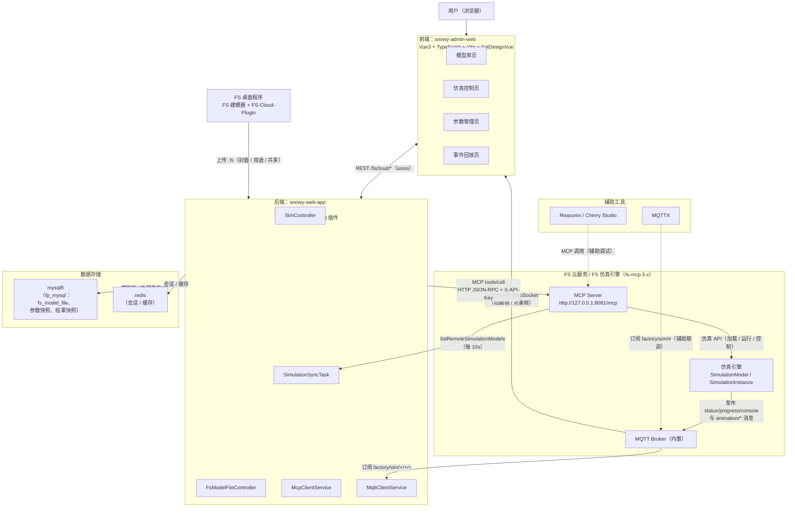

# 系统逻辑架构（call-fs-mcp Demo）

对应 PlantUML 源文件：[`archEx.wsd`](./archEx.wsd)

```mermaid
flowchart TB
    USER["用户（浏览器）"]

    subgraph FE["前端：snowy-admin-web<br/>Vue3 + TypeScript + Vite + AntDesignVue"]
        P1["模型库页"]
        P2["仿真控制页"]
        P3["参数管理页"]
        P4["事件回放页"]
    end

    subgraph BE["后端：snowy-web-app<br/>SpringBoot + Java<br/>+ snowy-plugin-fscloud 插件"]
        SimController["SimController"]
        FsModelFileController["FsModelFileController"]
        McpClientService["McpClientService"]
        MqttClientService["MqttClientService"]
        SimulationSyncTask["SimulationSyncTask"]
    end

    subgraph FS["FS 云服务 / FS 仿真引擎（fs-mcp 5.x）"]
        MCPSERVER["MCP Server<br/>http://127.0.0.1:8081/mcp"]
        ENGINE["仿真引擎<br/>SimulationModel / SimulationInstance"]
        MQTTBROKER["MQTT Broker（内置）"]
    end

    subgraph DB["数据存储"]
        MYSQL["mysql8<br/>（fp_mysql：fs_model_file、<br/>参数快照、结果快照）"]
        REDIS["redis<br/>（会话 / 缓存）"]
    end

    subgraph TOOL["辅助工具"]
        MQTTX["MQTTX"]
        AI["Reasonix / Cherry Studio"]
    end

    FSDESK["FS 桌面程序<br/>FS 建模器 + FS-Cloud-Plugin"]

    USER --> FE

    FE <-->|"REST /fscloud/*（axios）"| BE
    MQTTBROKER -->|"MQTT over WebSocket<br/>（动画帧 / 对象帧）"| FE

    BE -->|"MCP tools/call<br/>HTTP JSON-RPC + X-API-Key"| MCPSERVER
    MQTTBROKER -->|"订阅 factory/sim/+/+/+"| MqttClientService
    MCPSERVER -->|"listRemoteSimulationModels（每 10s）"| SimulationSyncTask

    MCPSERVER -->|"仿真 API（加载 / 运行 / 控制）"| ENGINE
    ENGINE -->|"发布 status/progress/console<br/>与 animation/* 消息"| MQTTBROKER

    BE -->|"模型库 / 快照落库"| MYSQL
    BE -->|"会话 / 缓存"| REDIS

    FSDESK -->|"上传 .fs（封面 / 用途 / 共享）"| BE
    MQTTX -.->|"订阅 factory/sim/#（辅助联调）"| MQTTBROKER
    AI -.->|"MCP 调用（辅助调试）"| MCPSERVER
```
